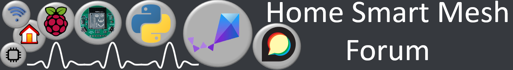

# Discourse forum
get support, give feedback or simply chat about ideas on the forum

[](https://homesmartmesh.discourse.group/c/networks/ultrawideband/10)

[Home Smart Mesh Forum - Ultra Wide Band Category](https://homesmartmesh.discourse.group/c/networks/ultrawideband/10)

# mesh_position
High level Analysis and Apps for Mesh Position. An Ultra Wide Band RTLS with json API
# install
```shell
pip install -r requirements
pip install jupyterlab
jupyter-lab
```

# MP todos
- Python API reliable all config update

# cli test
UWB
```shell
sm{"uwb_cmd":"config"}
sm{"uwb_cmd":"ping", "pinger":0,"target":1,"at_ms":100}
sm{"uwb_cmd":"twr","initiator":0,"responder":1,"at_ms":200}

sm{"uwb_cmd":"twr","initiator":4,"responders":[0,1,2,3],"at_ms":100,"step_ms":10,"count":3,"count_ms":50}


sm{"uwb_cmd":"cir_acc","offset":0,"len":200}


```

RF
```shell
sm/1CF6567337562176{"rf_cmd":"ping"}
sm/1CF6567337562176{"rf_cmd":"target_ping","target":"CBC216DC164B1DE8"}
```

